# Text-to-SQL Agent — Architecture at a Glance

**For business stakeholders**

---

## What It Does

Users ask questions in plain English (e.g. *“What are the top 5 product categories by total revenue?”*). The system turns that into a safe, read-only database query, runs it, and returns a clear answer with key numbers and a short analysis—**without exposing sensitive data** and **without allowing any changes to the data**.

---

## High-Level Flow

---

## Pipeline Stages (Business View)

| Stage | Name | Purpose |
|-------|------|--------|
| **0** | Setup | Start the run, create a unique run ID, initialize logging for auditability. |
| **1** | Understand & prepare | In parallel: check input for safety, load the data source and its structure, and interpret the user’s **business intent** (goal, metrics, filters, time range). |
| **2** | Technical spec | Turn business intent into a precise, structured specification for the query (what to select, filter, group, and limit). |
| **3** | SQL generation | Generate a single read-only SQL query from the technical spec and schema. |
| **4** | Validation | **Deterministic checks** (syntax, read-only, allowed tables/columns) act as the **hard gate**; an advisory AI review adds an extra layer. If validation fails, the system can retry SQL generation (up to 3 attempts) with the error details. |
| **5** | Execution | Run the validated query on the data; results are saved and a preview is built. |
| **6** | Analysis & synthesis | Analyze the results (summary, findings, caveats) and produce a **user-friendly final answer** with the SQL used and key numbers. |

---

## Key Benefits for the Business

- **Safety first**  
  Only read-only queries are allowed. No inserts, updates, deletes, or schema changes. Validation is rule-based and deterministic, not only AI-based.

- **Controlled data access**  
  Queries are restricted to allowed tables and columns. PII columns are tagged and redacted in previews shown to the user.

- **Auditability**  
  Every run is logged (stages, events, artifacts). You can trace what question was asked, what SQL was run, and what was returned.

- **Self-correction**  
  If the generated SQL fails validation, the system retries with the error feedback (up to 3 attempts), improving success without manual intervention.

- **Clear output**  
  The final answer is written for business users: executive summary, main numbers, caveats, and suggested follow-up questions.

---

## End-to-End in One Sentence

**Question in (natural language) → business intent → technical spec → SQL → validated → executed → analyzed → concise answer out (with optional SQL and redacted preview).**

---

*Generated from the Text-to-SQL Agent build plan. For implementation details, see the plan file and `README.md`.*
